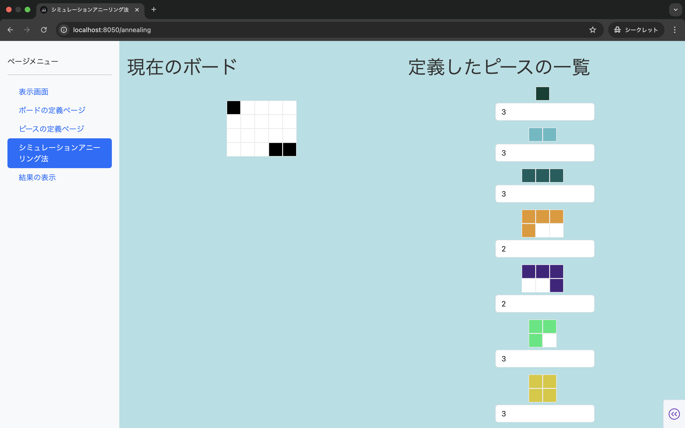

# toy-polyomino-simulated-annealing
ポリオミノ配置を焼きなまし法で探索するおもちゃ

# 準備
`python 3.12.8`で動作を確認しています。

`pip install -r requirements.txt`

# 起動
```
% cd src
% python app.py --debug=True
```


# 操作
## ボードの定義


## ボードとピース定義後のホーム画面


## シミュレーション画面



## 結果画面
